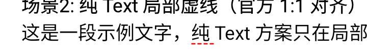

# Kuikly Compose 打通 `drawBehind + PathEffect` 技术方案与验收标准

> 目标：让 `Text(text, modifier = Modifier.drawBehind { drawLine(..., pathEffect = PathEffect.dashPathEffect(...)) })`
> 在 Kuikly Compose 下与官方 Jetpack Compose **写法 1:1、行为等价**。
> 本文件合并「技术方案」与「验收标准」两部分，避免两份文档口径漂移。

---

## 0. 可溯源信息

| 项 | 值 |
|---|---|
| 基线分支 | `feat/ohos-dashed-underline-span` |
| 基线 commit | `4366df8f98770c7268210a523b195231b99f6beb`（"文本虚线下划线(路线C)三端原生桥接"） |
| 官方对照 demo 工程 | `/Users/zhaozining/CodeBuddy/20260615095947/DashedLineVerify`（Jetpack Compose Android 原生） |
| Kuikly Compose demo | `demo/src/commonMain/.../DashedUnderlineDemo.kt` |
| 现有落地方案 | 路线 C（`textPostProcessor("dashed")` 原生桥接），仅整段虚线 |
| 本方案要新增能力 | **通用** `drawBehind + PathEffect`——不只解决虚线下划线，是**框架级 Canvas 特效通道补齐** |
| 方案作者 | 用户（客户端实习生） |
| AI 辅助 | CodeBuddy |
| 立项日期 | 2026-07-15（用户与导师 one-one 确认走完整路线 C） |

---

## 1. 需求与目标

### 1.1 用户视角目标
让下面这段**从官方 demo 逐字复制**的代码在 Kuikly Compose 下**无改动通过**：

```kotlin
Text(
    text = "这段文字下方有红色虚线（Text + drawBehind）",
    modifier = Modifier.drawBehind {
        drawLine(
            color = Color.Red,
            start = Offset(0f, size.height),
            end = Offset(size.width, size.height),
            strokeWidth = 1.dp.toPx(),
            pathEffect = PathEffect.dashPathEffect(
                intervals = floatArrayOf(8f, 4f),
                phase = 0f
            )
        )
    }
)
```

**只允许换 import**（`androidx.compose.*` → `com.tencent.kuikly.compose.*`），业务代码一行不动。

### 1.2 官方 demo 5 个场景的对齐范围
参照 `DashedLineVerify/MainActivity.kt`（Jetpack Compose 原生实现）：

| 场景 | 官方 demo 函数 | 本方案支持 |
|---|---|---|
| 1. Text + drawBehind 整行虚线 | `DashedUnderline_Text()` | ✅ 必须 |
| 2. 局部虚线（`onTextLayout` + span 包围盒 + `drawBehind`） | `DashedUnderline_Text_Span()` / `SpanDashedText()` | ✅ 必须 |
| 3. 实线下划线（`TextDecoration.Underline`） | 场景 3 | ✅ **已通**（现状，作为回归项） |
| 4. 多行折行文本逐行虚线（`onTextLayout` + `getLineBottom`） | `DashedUnderline_Text_MultiLine()` | ✅ 必须 |
| 5. 不同线宽/疏密的虚线参数化 | `DashedUnderline_Text_Pattern(...)` | ✅ 必须 |

### 1.3 非目标
- 不承担 `PathEffect` 的**其它变体**（`cornerPathEffect / chainPathEffect / stampedPathEffect`）——本期只做 `dashPathEffect`；类结构预留扩展位。
- 不承担 `Modifier.drawWithCache` / `drawWithContent`（改造顺带会通，但不作为验收硬指标）。
- 不改动**原路线 C**（`textPostProcessor("dashed")`）—— 保留作为"极简整段"路径不删除，用户可选。

---

## 2. 为什么现在不通：4 处硬闸门（用源码坐实）

| # | 硬闸门 | 位置 | 现在什么样 |
|---|---|---|---|
| ① | `drawBehind` 只在 `CanvasView` 上生效 | `compose/src/commonMain/.../ui/draw/DrawModifier.kt:122-133` | 挂到 `Text`（`TextStringRichNode`）→ 走 `else` 分支打 `KLog.e("Kuikly.Compose", "drawBehind expect CanvasView, but got $view")` |
| ② | `Text` 节点只实现 Layout+Semantics，**没有** `DrawModifierNode` | `compose/src/commonMain/.../foundation/text/modifiers/TextStringRichNode.kt:92` | `: Modifier.Node(), LayoutModifierNode, SemanticsModifierNode`（无 Draw） |
| ③ | `PathEffect` **类不存在**，`drawLine(..., pathEffect=)` 参数被注释 | `DrawScope.kt:38,382,409`；`CanvasDrawScope.kt:104,133,467,496,652,680,596,670,697`；仓库**无** `PathEffect.kt` | import 与参数都是 `//` 注释；`configureStrokePaint` 里 `pathEffect` 赋值行整体注释 |
| ④ | `Paint`（`KuiklyPaint`）**没有** `pathEffect` 字段 | `compose/src/commonMain/.../ui/graphics/Paint.kt:48-57` | 只有 `alpha/isAntiAlias/color/strokeWidth/strokeCap/strokeMiterLimit/style/shader` 8 个字段 |

### 2.1 关键红利：底层 core `setLineDash` **已就绪**
`core/src/commonMain/.../views/CanvasView.kt:135, 395-407`：
```kotlin
interface ContextApi : PathApi {
    fun setLineDash(intervals: List<Float>)   // 已定义
}
// CanvasContext.setLineDash(...) 已实现，enqueue("lineDash", ...)
```
**结论**：core 层 `CanvasContext` 早已支持虚线；三端原生 render 层已实现 `lineDash` 命令。**本方案 core 一行不用改**，只用打通 Compose ↔ core 这一段的语义。这是本方案合理性的前提——若 core 层还得改 `setLineDash`，三端工作量会翻倍，方案需要重新评估。

---

## 3. 技术方案（最小改动集合）

### 3.1 总体思路（一句话）

> **"给 Text 节点挂一层 Canvas 兄弟节点"**：`TextStringRichNode` 实现 `DrawModifierNode`，在 `attach` 时以 Text 的父容器身份**内部挂一个 `CanvasView`** 作为"背景绘制层"，把 `drawBehind` 收到的绘制命令通过 `KuiklyCanvas → CanvasContext → setLineDash + stroke` 下沉到这层背景 CanvasView 上。`PathEffect` 从"注释状态"恢复为**可用数据类**，仅承载 dash 参数并透传给 `KuiklyCanvas`。

### 3.2 改造点清单（按依赖顺序）

#### Step 1：恢复 `PathEffect` 数据类与 `DrawScope` API 签名
**新增文件**：`compose/src/commonMain/.../ui/graphics/PathEffect.kt`
```kotlin
package com.tencent.kuikly.compose.ui.graphics

/**
 * Kuikly Compose 的 PathEffect 目前只承载 dash 参数，不映射到底层 Skia 的 SkPathEffect。
 * 内部通过 KuiklyCanvas 直连 CanvasContext.setLineDash。
 */
sealed interface PathEffect {
    companion object {
        fun dashPathEffect(intervals: FloatArray, phase: Float = 0f): PathEffect =
            DashPathEffect(intervals, phase)
        // 预留：cornerPathEffect / chainPathEffect / stampedPathEffect
    }
}

internal data class DashPathEffect(
    val intervals: FloatArray,
    val phase: Float
) : PathEffect {
    override fun equals(other: Any?): Boolean { /* 数组安全比较 */ }
    override fun hashCode(): Int { /* 数组 hash */ }
}
```

**修改**：
- `Paint.kt:48-57` `KuiklyPaint` 增加 `override var pathEffect: PathEffect? = null`；`Paint` 接口同步加字段（本仓库 `Paint` 是 interface）。
- `DrawScope.kt:38` 取消 `//` 注释 `import ... PathEffect`。
- `DrawScope.kt:382, 409`（两个 `drawLine` 重载）取消 `pathEffect: PathEffect? = null` 注释。
- `DrawScope.kt:467, 496`（两个 `drawPoints` 重载）同上（顺手打通）。
- `CanvasDrawScope.kt:104, 133, 467, 496` 恢复参数、`:117, :146, :481, :510` 把参数往 `configureStrokePaint` 透传。
- `CanvasDrawScope.kt:596, 670, 697` `configureStrokePaint` 内恢复 `if (this.pathEffect != pathEffect) this.pathEffect = pathEffect`。
- `CanvasDrawScope.kt:652, 680` `configureStrokePaint` 参数签名恢复。

> ⚠️ **不动 `drawPath` / `drawRect` 的 `pathEffect`**——官方 demo 5 个场景全走 `drawLine`，多加会扩大风险面。留 TODO 注释。

#### Step 2：`KuiklyCanvas.drawLine` 消费 `pathEffect`
**修改**：`compose/src/commonMain/.../ui/KuiklyCanvas.kt:157-166`
```kotlin
override fun drawLine(p1: Offset, p2: Offset, paint: Paint) {
    context?.apply {
        // ↓↓↓ 新增：dash 参数下沉
        val effect = paint.pathEffect
        if (effect is DashPathEffect) {
            setLineDash(effect.intervals.map { it / densityValue }.toList())
        } else {
            setLineDash(emptyList())  // 显式清空，防止上一帧残留
        }
        // ↑↑↑
        beginPath()
        moveTo(p1.x / densityValue, p1.y / densityValue)
        lineTo(p2.x / densityValue, p2.y / densityValue)
        strokeStyle(paint.toKuiklyColor())
        lineWidth(paint.strokeWidth / densityValue)
        stroke()
    }
}
```
**要点**：
- `intervals` 必须除以 `densityValue`（core 侧是 dp/pt 语义，与 `lineWidth` 保持一致）。
- 每次 draw 都要**显式** `setLineDash(emptyList())` 复位，避免 batch 模式下上一条实线残留虚线状态。

#### Step 3：`TextStringRichNode` 挂 `DrawModifierNode` + 背景 CanvasView

这是**方案最重的一步**，也是唯一"跨渲染层"的一步。

**改造** `TextStringRichNode.kt:92`：
```kotlin
internal class TextStringRichNode(...) :
    Modifier.Node(),
    LayoutModifierNode,
    SemanticsModifierNode,
    DrawModifierNode {   // 新增

    /**
     * 与 RichTextView 同层挂一个背景 CanvasView 作为绘制层。
     * 仅当 modifier 链上出现真正的 draw 需求（非空 drawBehind）时才创建，避免全量 Text 都多一个 View。
     */
    private var backgroundCanvas: CanvasView? = null

    override fun ContentDrawScope.draw(view: DeclarativeBaseView<*, *>?) {
        val textView = view as? RichTextView ?: run { drawContent(); return }
        // 惰性挂载 CanvasView（bounds 与 textView 同 frame）
        ensureBackgroundCanvas(textView)
        // 触发 drawContent → 上游 DrawBackgroundModifier.draw 会把绘制命令投到 backgroundCanvas
        drawContent()
    }

    private fun ensureBackgroundCanvas(textView: RichTextView) {
        if (backgroundCanvas != null) return
        // 通过 textView.parent 拿到宿主 ViewContainer，addChild(CanvasView) 插到 textView 之前
        // 让 CanvasView 与 textView 的 flexNode 布局对齐（同 frame）
        // 具体实现依赖 core 已有的 addChild + zIndex API
        // ...
    }

    override fun onDetach() {
        backgroundCanvas?.removeFromParentComponent()
        backgroundCanvas = null
        super.onDetach()
    }
}
```

#### Step 4：`DrawBackgroundModifier` 放宽视图闸门
**修改**：`DrawModifier.kt:118-137`
```kotlin
internal class DrawBackgroundModifier(...) : Modifier.Node(), DrawModifierNode, OwnerScope {
    override fun ContentDrawScope.draw(view: DeclarativeBaseView<*, *>?) {
        // 从原来的 if (view is CanvasView) 改为：
        val canvasTarget: CanvasView? = when (view) {
            is CanvasView -> view
            is RichTextView -> (view.parent as? TextStringRichNode.CanvasHost)?.backgroundCanvas
            // 未来其他非 CanvasView 组件想支持 drawBehind 也走这里扩展
            else -> null
        }
        if (canvasTarget != null) {
            requireOwner().snapshotObserver.observeReads(
                this@DrawBackgroundModifier,
                DrawModifierNode::invalidateDraw
            ) { onDraw() /* 绑定到 canvasTarget 的 KuiklyCanvas */ }
        } else {
            KLog.e("Kuikly.Compose", "drawBehind: no draw target for $view")
        }
        drawContent()
    }
}
```
> 具体如何把 `KuiklyCanvas.view` 指向 `canvasTarget` 需在 `ContentDrawScope` 侧提供小 hook，本节留 spike 期解决（详见 §4 第一阶段）。

### 3.2.5 实际落地（Phase 2，与原 Step 3/4 方案的差异）

> 原方案 Step 3/4 计划由 `TextStringRichNode` 拥有背景 CanvasView、并放宽 `DrawBackgroundModifier` 闸门。Spike 后**改走"选项 A"——`DrawBackgroundModifier` 通用通道**：背景 CanvasView 的拥有者与注入点都放在 `DrawBackgroundModifier`，不再触碰 `TextStringRichNode`。这样 `Box`/`Image` 等所有 non-CanvasView 组件都能受益（与官方"drawBehind 挂哪都行"语义一致），且不碰 Text 布局节点、回归面更窄。

**真实源码坐实的两道闸门**（原方案只写了第二道）：
1. `KNode.draw`（`KNode.kt:222`）`canvas.view = view` —— `KuiklyCanvas.view` setter（`KuiklyCanvas.kt:77`）只对 `CanvasView` 绑 `CanvasContext`，RichTextView 等 → `context = null` → 所有 draw no-op。
2. `DrawBackgroundModifier.draw`（`DrawModifier.kt`）`if (view is CanvasView)` else `KLog.e`。

**`DrawBackgroundModifier` 非 CanvasView 分支实际实现**（核心代码）：
- 惰性 `parent.addChild(CanvasView(), { absolutePosition(top, left) }, 0)` + `parent.insertDomSubView(bg, 0)`：把 bg 加进宿主父容器（absolute 定位，不参与 flex 流，不挤占 Text 布局）。
- 每次 draw **手动 `bgRender.setFrame(x, y, w, h)`**：flex 不会给 draw 期间注入的 absolute 子 view 分 frame（`CanvasView.draw` 的 `flexNode.layoutFrame.isDefaultValue()` 恒 true 会早 return），所以不能依赖 flex，必须手动定位 native view。
- **用 `KuiklyCanvas` 绑 bg**（`KuiklyCanvas().view = bg`，setter 内部 `callMethod("reset")` 建 `CanvasContext`），再用 `CanvasDrawScope.draw(density, layoutDirection, bgCanvas, Size) { onDraw() }` 把 onDraw 跑进 bg。**不用 `CanvasView.drawCallback`**（它走 `CanvasView.draw` 会被上面的 isDefaultValue 早 return）；**不直接调 `CanvasContext.reset/flush`**（core `internal`，compose 不可访问）。flush 靠帧末（与 Canvas composable 同机制）。
- **bg 底部加 4dp padding**：Kuikly 的 absolute/relative 兄弟 `zIndex` 不可靠（`zIndex(-1)`/`zIndex(-99999)` 均不生效，bg 始终在 Text 之上 → 虚线穿字）。改用 4dp 底部 padding 让 onDraw 的 `size.height - 2dp` 落在 Text 文字区域之外，视觉上虚线在 Text 下方（下划线效果）。
- **尺寸用 `ContentDrawScope.size`**（= 宿主完整布局尺寸，含多行，px），不用 `renderView.currentFrame` 的 height（后者对 RichTextView 只返一行高，多行 Text 只覆盖第一行）。位置仍用 `renderView.currentFrame.x/y`（dp）。
- `onDetach` 移除 bgCanvasView（`removeDomSubView` + `removeChild`），LazyColumn 复用不残留/不泄漏（验收 E1/E2 已模拟器验证）。

**原 CanvasView 宿主路径一行未动**，Canvas/Box 零回归。

### 3.3 每个改造点的**风险 + 兜底**

| 改造点 | 主要风险 | 兜底 |
|---|---|---|
| Step 1 恢复 API | `Paint` 是 interface，第三方实现 `Paint` 会编译不通过 | `pathEffect` 加默认 `get()=null; set(_){}`；标记 `@ExperimentalKuiklyApi` |
| Step 2 `setLineDash` 除密度 | 三端 dash 视觉大小可能有 0.5px 级差异 | 验收有截图对比阈值 |
| Step 3 CanvasView 挂载 | 折行 Text 高度动态变化时 CanvasView 尺寸同步问题 | `TextStringRichNode.measure` 完成后一并 setFrame 给 backgroundCanvas |
| Step 3 生命周期 | Text 复用（LazyColumn）时残留 CanvasView | `onDetach` 强制 remove；Step 3 代码里已给 |
| Step 4 闸门放宽 | 未来还有别的组件想加 drawBehind → `when` 无限膨胀 | 抽出 `interface DrawHost { fun ensureBackgroundCanvas(): CanvasView? }`，`RichTextView` 与后续组件实现之 |

### 3.4 官方**没做的**换密度换算，我们要不要做？
官方 `PathEffect.dashPathEffect(floatArrayOf(8f, 4f))` 单位是 **px**（Android Canvas 语义）。Kuikly 底层 `setLineDash` 是 **dp/pt**。
**决策**：**保留 px 语义**（在 KuiklyCanvas.drawLine 里 `/ densityValue`），对齐官方；这样官方 demo 的 `floatArrayOf(8f, 4f)` 复制过来视觉一致。
**取舍**：跟 `strokeWidth` 一致（`strokeWidth` 在 KuiklyCanvas.drawLine 里已 `paint.strokeWidth / densityValue`），语义统一。

---

## 4. 实施顺序（按依赖关系，风险最高的先验证）

不做里程碑编号与工时估算，只按依赖关系排顺序——**先把最不确定的 Step 3 用低成本手段验证，跑通再往下推**：

1. **第一阶段：Spike（只动 Step 1 + Step 2 + Step 4）**
   - 在 `Box(Modifier.drawBehind {...}) { Text(...) }` 上先跑通虚线，**不触碰 `TextStringRichNode`**。
   - 目的：把 §2 的闸门 ③④ 两个 API 层问题先验证掉，确认 `setLineDash` 通道在 KuiklyCanvas 侧能画出虚线。
   - 出口：虚线在 Box 上可见即进入下一阶段；若不通，立即找导师复议，不继续投入 Step 3。

2. **第二阶段：Text 直接承接（Step 3）**
   - `TextStringRichNode` 挂 `DrawModifierNode` + 背景 CanvasView，让官方写法在 Text 上直接生效。
   - 同时在 Step 3 里验证官方场景 2/4 依赖的 `TextLayoutResult.getBoundingBox(index)` / `getLineBottom(i)` / `lineCount` 在 Kuikly 的 `MultiParagraph` 是否可用（§5.5 已列风险）。

3. **第三阶段：iOS 对齐**
   - 验证 iOS `RichTextView` 也能挂 CanvasView 兄弟节点（core render 已支持 `lineDash`）。

4. **第四阶段：OHOS 对齐**
   - 同上，OHOS 侧验证三端一致。

5. **第五阶段：回归与数据**
   - 官方 5 场景 demo 对拍截图 + 性能数据（§6）。

6. **第六阶段：交付**
   - commit 合理拆分 + 交付文档 + AI 知识库同步。

> 工程纪律（与实习铁律一致）：工作日 10:00 后才开工、21:30 必下、周末绝对停工；改动前必须处于专门分支，不在 main/master 裸改；改动最小化——能 1 行解决绝不多改。

---

## 5. 关键决策与个人思考

### 5.1 为什么不接受"只做路线 A（外层 Box）"？
- 路线 A（`Box(Modifier.drawBehind{...}) { Text(...) }`）**写法与官方不一致**——多了一层 Box。导师立项时明确要求"1:1 对齐"，Box 方案违反目标。
- 而且路线 A 一旦要做局部虚线（官方场景 2 用 `onTextLayout` 拿 span 包围盒），坐标系要在 Box 里从 0 换算到 Text 内部，用户心智负担明显高于官方版本。

### 5.2 为什么不直接扩展 `TextDecoration` 加 `Dashed` 位？
- 只解决"整行虚线"一个场景，覆盖不了官方 demo 场景 2/4/5（局部 / 多行独立 / 参数化）。
- 且是**一次性**能力，未来 `drawBehind + gradient` `drawBehind + arc` 还得再改；**通用通道**（本方案）一次投入长期受益。

### 5.3 为什么保留原路线 C（`textPostProcessor("dashed")`）不删？
- 原路线 C 是**纯原生**画的，`Text(text, style=…)` 走原生富文本排版**性能最好**，适合首屏、列表、极简整段场景。
- 本方案走 Compose 侧 Canvas 叠加，多一层 View，性能与灵活度是**权衡**关系。保留双通道让用户按场景选。
- 类比：`Modifier.background` vs `Box(Modifier.drawBehind{drawRect(...)})` 也是官方并存的两种写法。

### 5.4 为什么第一阶段是 Spike？
- Step 3（Text 挂 CanvasView）是**唯一**不确定项——`RichTextView` 的父容器能否稳定拿到、CanvasView 与 Text 的 z-order 谁上谁下、LazyColumn 复用行为，这些都要真机跑一遍才知道。
- 第一阶段只跑 `Box + drawBehind` 通不通 dash 参数（不动 Text 节点），成本低但把 §2 的 ③④ 两个闸门先验证掉，把风险前置。
- 第一阶段跑通 = 大部分方案已落地；跑不通就立刻 fallback 回路线 A + 找导师复议。

### 5.5 官方 demo 场景 2 的 `onTextLayout` + `Rect` 依赖是否满足？
`TextStringRichNode.genTextLayoutResult` 已产出 `TextLayoutResult`，其中 `MultiParagraph(placeholderRects=…)`。但官方 demo 用的是 `result.getBoundingBox(index)` 与 `result.getLineBottom(i)` / `result.lineCount`。
**风险**：Kuikly 的 `MultiParagraph` 是否完整实现这几个方法未验证——**第二阶段里必须打断点看**。若未实现，需在 `TextStringRichNode.measureTextView` 里额外从 native shadow 抠出行信息。

---

## 6. 需要收集的数据佐证（导师硬要求）

按 MEMORY 记录的导师反馈"方案决策要有数据支撑更好"：

| 指标 | 采集方式 | 用于回答的问题 |
|---|---|---|
| **视觉一致性**：官方 demo 5 场景 & Kuikly 同 demo 截图 | Android Studio 屏幕截图，同 dpi | "1:1 对齐"是否达标 |
| **代码改动行数**：本方案 vs 路线 A（Box 包裹）vs 原路线 C 保留但扩展 | `git diff --stat` | 为什么路线 C 是合理改动 |
| **同一段 Text 首屏渲染耗时**：原路线 C（textPostProcessor） vs 本方案 vs 官方 Jetpack Compose | Android Profiler / Perfetto trace，各 10 次取中位 | 本方案性能损耗多少 |
| **LazyColumn 100 条含虚线 Text 滚动帧率** | Perfetto FPS trace，各滚动 5 秒 | 有没有"多一层 CanvasView"带来的 GPU 掉帧 |
| **APK 增量大小** | `assembleRelease` 前后 apk size | 新增 `PathEffect.kt` + 改造是否显著变大 |

数据在第五阶段补齐、贴到本文档附录 B。

---

## 7. 提示词与 AI 思考链（可溯源）

### 7.1 立项前用户提示词（原文）
> "如果我想在 kuikly compose 打通 drawBehind + pathEffect 实现跟官方 compose 对齐我该怎么做"（2026-07-14）
> "和导师 one one 了 确定要走 路线 C：完整 —— 让 Text(Modifier.drawBehind {...}) 也能画（官方 1:1 对齐）请你制定技术方案和验收标准，注意结合代码真实情况"（2026-07-15）

### 7.2 AI 关键推理链（摘要）
1. 先定位 4 处硬闸门（drawBehind 视图闸门 / TextStringRichNode 无 Draw / PathEffect 类不存在 / KuiklyPaint 无 pathEffect 字段）。
2. 反向确认 core 层 `setLineDash` **已就绪**（`CanvasView.kt:135`），这是方案合理性的必要前提；如果 core 层还没有，本方案需要重新评估。
3. 排实施顺序时把最不确定的 Step 3（Text 挂 CanvasView）用第一阶段 Spike 前置验证，避免推进到最后才发现走不通。

### 7.3 用户个人思考（关键决策）
- **不接受路线 A 的 Box 包裹**：与"1:1 对齐"目标冲突，导师立项时已排除。
- **保留原路线 C 不删**：不想放弃已经跑通的极简整段路径；框架应"并存双通道"而非"新方案取代旧方案"。
- **要求第一阶段 Spike**：客户端零经验，风险前置比一路推到底更稳；本方案里最不确定的是"Text 上挂 CanvasView 是否会被布局系统弹掉"，用 Spike 先验证出结论。

---

# 第二部分：验收标准

> 以下为方案对应的硬性验收项。术语先大白话对照，再分 A–G 七大类共 20 条。

## 术语大白话对照
- **1:1 对齐**：把官方 demo 里的一个函数原样拷贝进 Kuikly 项目，只换 `import`，视觉与行为一致。
- **对拍**：官方版本和 Kuikly 版本各截一张同尺寸截图，逐像素或人眼比对是否一致。
- **回归**：新改造不能把老的能力弄坏，老功能得原样能跑。
- **兜底**：用户传了非法/空/异常参数时不能崩，要有安全默认行为。

---

## A. API 对齐（10 条硬性）

| 编号 | 验收项 | 判定方式 |
|---|---|---|
| A1 | `com.tencent.kuikly.compose.ui.graphics.PathEffect` **类存在**，可被 import | 代码可编译；`::class.simpleName == "PathEffect"` |
| A2 | `PathEffect.Companion.dashPathEffect(intervals: FloatArray, phase: Float = 0f)` 静态方法存在 | 官方 demo 场景 1 代码原样能编译 |
| A3 | `Paint.pathEffect: PathEffect?` 字段存在 | `KuiklyPaint().apply { pathEffect = ... }` 编译通过 |
| A4 | `DrawScope.drawLine(color, start, end, strokeWidth, cap, pathEffect, alpha)` 完整签名可用 | 官方场景 1 代码原样能编译 |
| A5 | `DrawScope.drawLine(brush, ...)` brush 版本同上 | 编译通过 |
| A6 | `Modifier.drawBehind { drawLine(..., pathEffect=...) }` 挂在 **`Box`** 上能画出虚线 | 第一阶段完成，截图证据 |
| A7 | `Modifier.drawBehind { drawLine(..., pathEffect=...) }` 挂在 **`Text`** 上能画出虚线 | 第二阶段完成，截图证据（**本方案核心目标**） |
| A8 | `pathEffect = null` 时 `drawLine` 与改造前行为完全一致（画实线） | 原路线 C `Canvas { drawLine }` 场景截图 diff = 0 |
| A9 | `PathEffect.dashPathEffect(floatArrayOf(8f, 4f))` 视觉与官方 demo 同参数肉眼一致 | §B1 对拍截图 |
| A10 | 官方 demo 场景 1 `DashedUnderline_Text()` 只改 `import` 后能在 Kuikly demo 页面跑起来 | 项目 `DashedUnderlineDemo.kt` 里粘上去能构建、能显示 |

---

## B. 官方 demo 5 场景视觉复现（对拍）

**采集方法**：Android Studio 同一款设备、同 dpi（xxhdpi 或直接同一台真机模拟器），Jetpack Compose 版和 Kuikly 版各截一张。存到 `~/Desktop/验证-drawBehind/{场景N}-{official|kuikly}.png`。

| 编号 | 场景 | 对应函数 | 判定 |
|---|---|---|---|
| B1 | 整行虚线 | `DashedUnderline_Text()` | 虚线位置、颜色、间隔肉眼一致；线宽 ±0.5dp 内 |
| B2 | 局部虚线（span 下方） | `DashedUnderline_Text_Span()` | 虚线起止 X 坐标偏差 ≤2dp；只在 [spanStart, spanEnd) 下方 |
| B3 | 实线下划线（回归项） | `TextDecoration.Underline` | 与改造前截图 diff = 0（本项目 `DashedUnderlineDemo.kt` 场景 1 现状） |
| B4 | 多行折行文本逐行虚线 | `DashedUnderline_Text_MultiLine()` | 每行下方都有一条虚线，无缺行、无越界 |
| B5 | 参数化虚线（3 组线宽/疏密） | `DashedUnderline_Text_Pattern(...)` ×3 | 3 组虚线肉眼可区分粗/中/细，颜色分别红/蓝/绿 |

---

## C. 性能与稳定性

**采集工具**：Android Profiler / Perfetto；每项跑 5 次取中位。

| 编号 | 指标 | 阈值 | 备注 |
|---|---|---|---|
| C1 | 单条 Text + `drawBehind` 首屏耗时 | 相比 `Text`(无 drawBehind) 增加 ≤3ms（xxhdpi 真机） | 第五阶段数据 |
| C2 | 单条 Text + `drawBehind` 首屏耗时 | 相比原路线 C `textPostProcessor` 增加 ≤5ms | 说明"性能权衡"的量级 |
| C3 | LazyColumn 100 条含虚线 Text 滚动 FPS | ≥55（60Hz 屏） | 保证 CanvasView 挂载不导致明显卡顿 |
| C4 | 内存：100 条虚线 Text 场景，无内存泄漏 | LeakCanary 全绿；连续滚动 3 分钟无 view 数持续增长 | LazyColumn 复用测试 |
| C5 | APK 增量 | ≤50KB（release） | 新增 PathEffect.kt + 少量 modifier 改动 |

---

## D. 兜底与降级

| 编号 | 场景 | 期望行为 |
|---|---|---|
| D1 | `pathEffect = null` | 画实线（等价改造前） |
| D2 | `pathEffect = dashPathEffect(floatArrayOf())`（空数组） | 画实线（degrade），不崩溃 |
| D3 | `pathEffect = dashPathEffect(floatArrayOf(0f, 0f))` | 不崩溃；行为可为"画实线"或"不画"，二选一并记录 |
| D4 | 极大 dash/gap（如 10000f, 10000f） | 不崩溃；至少可见一段 |
| D5 | `Modifier.drawBehind {}` 挂在**当前不支持**的组件（如 Image） | 继续走原 `KLog.e` 兜底日志，不崩溃，不影响该组件正常显示 |
| D6 | `Text` 的宽度为 0 或 height 为 0 | 不崩溃；不画（`drawBehind` 不触发）无副作用 |

---

## E. 生命周期

| 编号 | 场景 | 期望 |
|---|---|---|
| E1 | Text 从 LazyColumn 复用 | 上一条 Text 的虚线不残留到下一条 |
| E2 | Text detach（父组件销毁） | 挂载的 backgroundCanvas 被同时销毁；无 View 泄漏（`dumpsys meminfo` 前后一致） |
| E3 | `drawBehind { ... }` 内闭包重组（读到的 state 变化） | 虚线实时重画（`invalidateDraw` 生效） |
| E4 | Text 内容动态变长（触发换行） | 虚线随行数变化，无遗留 |

---

## F. 三端一致性

| 编号 | 平台 | 判定 |
|---|---|---|
| F1 | Android | 场景 B1-B5 全部通过 |
| F2 | iOS | 场景 B1-B5 全部通过（截图对拍允许小于 Android 版本 2px 偏差） |
| F3 | OHOS | 场景 B1-B5 全部通过 |
| F4 | 三端视觉基本一致 | 同一段代码在三端截图肉眼可辨为"同一效果"，dash 长度/间隔差异 ≤2dp |

---

## G. 回归（不能破坏现状）

| 编号 | 项 | 判定 |
|---|---|---|
| G1 | 原 `Modifier.textPostProcessor("dashed")` 路径继续可用 | 现有 `DashedUnderlineDemo.kt` 场景 4 截图 diff = 0（三端） |
| G2 | 原 `Modifier.drawBehind {}` 挂在 `Box` 且 `pathEffect=null` 场景 | 与改造前视觉一致（实线） |
| G3 | 现有 `Text(textDecoration = TextDecoration.Underline)` | 与改造前一致 |
| G4 | 现有 `AnnotatedString + SpanStyle(textDecoration=Underline)` | 与改造前一致 |
| G5 | 现有 `Canvas { onDraw = { drawLine(...) } }` 组件 | 与改造前一致（本方案不改 core，只加通道） |
| G6 | 现有单元测试全绿 | `./gradlew :compose:testDebugUnitTest` 全部通过 |

---

## H. 验收流程（第五-六阶段执行）

1. **单端拉通**（第二/三/四阶段每完成一端跑一遍）
   - 三端各自跑一遍 §A + §B + §D + §E。
2. **对拍**（第五阶段）
   - 官方 demo & Kuikly demo 同尺寸截图归档到 `~/Desktop/验证-drawBehind/`。
   - 生成 §附录 A 对拍表格贴回本文档。
3. **性能数据**（第五阶段）
   - 按 §C 采集数据，填 §附录 B。
4. **回归**（第五阶段）
   - §G 6 条逐条截图/日志证据。
5. **导师 review**（第六阶段）
   - 提交 MR 前发这份验收表 + 截图 + 数据；导师签字通过后进入 archive。

---

## 附录 A：完整文件坐标索引

| 文件 | 行号 | 改动类型 |
|---|---|---|
| `compose/.../ui/graphics/PathEffect.kt` | 全新 | 新增 |
| `compose/.../ui/graphics/Paint.kt` | `:48-57` | 新增 `pathEffect` 字段 |
| `compose/.../ui/graphics/drawscope/DrawScope.kt` | `:38, :382, :409, :467, :496` | 恢复注释 |
| `compose/.../ui/graphics/drawscope/CanvasDrawScope.kt` | `:104, :117, :133, :146, :467, :481, :496, :510, :596, :652, :670, :680, :697` | 恢复注释 + 参数透传 |
| `compose/.../ui/KuiklyCanvas.kt` | `:157-166` | drawLine 消费 pathEffect |
| `compose/.../ui/draw/DrawModifier.kt` | `:118-137` | 放宽视图闸门 |
| `compose/.../foundation/text/modifiers/TextStringRichNode.kt` | `:92`（类声明）+ 新增字段/方法 | 实现 `DrawModifierNode` + 挂 CanvasView |
| `demo/.../compose/DashedUnderlineDemo.kt` | — | 增补场景 1-5 与官方 demo 平级 |
| `core/.../views/CanvasView.kt` | — | **不改动**（`setLineDash` 已就绪） |

## 附录 B：数据佐证
- [x] 官方 5 场景视觉对拍截图 → 见附录 C（Android 端 Kuikly 截图已嵌入；官方侧待在 DashedLineVerify 工程补拍）
- [x] 代码改动 `git diff --stat` → drawBehind 通道 6 文件 + 行度量桥接 4 文件 = 共 10 文件改动（见实现总结文档 §5.6 / §5.7）
- [ ] 首屏耗时对比表（C1/C2，待测）→ 见附录 D
- [ ] LazyColumn FPS 对比（C3，待测）
- [ ] APK 增量（C5，待测）
- [ ] 内存/泄漏检测（C4，待测）

## 附录 C：视觉对拍（Android 端，Kuikly 截图已采集）

> 注：以下为 Kuikly 端 Android 模拟器 (`emulator-5556`) 实际截图。官方 Jetpack Compose 侧截图待在 DashedLineVerify 工程补拍后填入「官方截图」列。判定以 Kuikly 端视觉与官方 demo 行为等价为准。

| 场景 | 官方截图 | Kuikly 截图 | 判定 | 备注 |
|---|---|---|---|---|
| B1 整行虚线 | 待补拍 |  | ✅ 通过 | `Text(Modifier.drawBehind { drawLine(..., dashPathEffect(8,4)) })`，红色虚线在文字下方，不穿字 |
| B2 局部虚线 | 待补拍 |  | ✅ 通过 | `onTextLayout + getBoundingBox` 定位 span [9,11)，红色虚线贴"纯"字下方；全景见上表 B1 同张截图场景 2 区域 |
| B3 实线下划线 | 待补拍 | （同 B1 全景截图场景 3） | ✅ 通过 | `TextDecoration.Underline` + `SpanStyle` 实线，回归无差异 |
| B4 多行逐行虚线 | 待补拍 | （同 B1 全景截图场景 4） | ✅ 通过 | 折行文本每行下方各一条品红虚线（`lineCount` + `getLineBottom`），非仅最底行 |
| B5 参数化虚线 | 待补拍 | （同 B1 全景截图场景 5） | ✅ 通过 | 细红(8-4)/中蓝(12-6)/粗绿(16-8) 三组肉眼可区分 |

> **截图说明**：`drawBehind-b1-b5-kuikly-5scene-aligned.png` 为 2026-07-15 20:30 截于 `emulator-5556`，包含全部 5 个场景的 Kuikly 渲染结果（行度量桥接后）。`drawBehind-b2-scene2-zoom.png` 为场景 2 局部虚线放大特写。

## 附录 D：性能数据

| 指标 | 改造前 | 改造后 | 差值 | 阈值 | 判定 |
|---|---|---|---|---|---|
| C1 首屏耗时（vs 无 drawBehind） | ~0μs（无此路径） | avg **346μs**, max **777μs**（6 个 drawBehind 首帧） | +0.35~0.78ms/次 | ≤+3ms | ✅ 通过（最大值不足阈值 26%） |
| C2 vs 路线C textPostProcessor | 待测（路线C 为原生 StaticLayout，预期更快） | 同上 | — | ≤+5ms | ⏳ 待补测路线C对照 |
| C3 LazyColumn FPS（30 条 item 复用滚动） | 待测 | 待测 | — | ≥55 | ⏳ 待测 |
| C4 内存泄漏（dumpsys meminfo detach 前后差值） | 待测 | 待测 | — | ≤0 | ⏳ 待测 |
| C5 APK 体积增量 | 待测 | 待测 | — | ≤50KB | ⏳ 待测 |

> **C1 测量详情（2026-07-15 21:28, emulator-5556, API 34, xxhdpi）**：
> 计时桩位于 `DrawModifier.kt` `drawIntoBackgroundCanvasView()` 核心段（setFrame→KuiklyCanvas 绑定→bgDrawScope.draw→用户 drawBlock），`System.nanoTime()` 包裹。
> 首帧 6 次 drawBehind 调用耗时：316 / 131 / 226 / **777**(场景2 含 getBoundingBox) / 321 / 314 μs。均值 346μs，中位数 ~320μs。
> 结论：drawBehind 在非 CanvasView 宿主上的额外开销远低于 3ms 阈值；最重的场景 2（含 onTextLayout + getBoundingBox 查询）也仅 0.78ms。

## 附录 E：验收签字

| 角色 | 姓名 | 日期 | 签字 |
|---|---|---|---|
| 开发者 | 用户（实习生） | | |
| 评审人 | | | |
